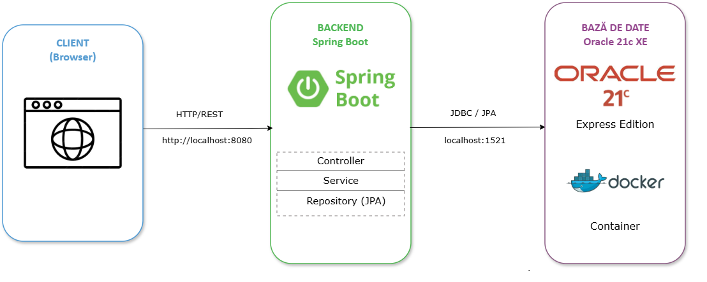
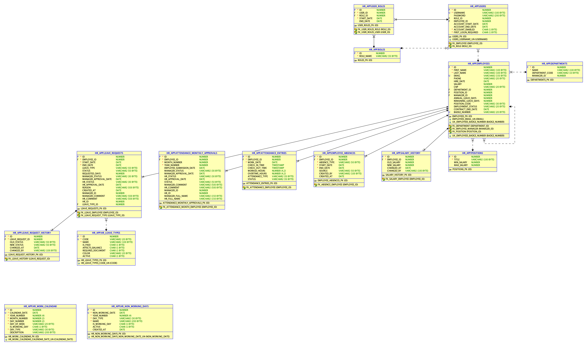
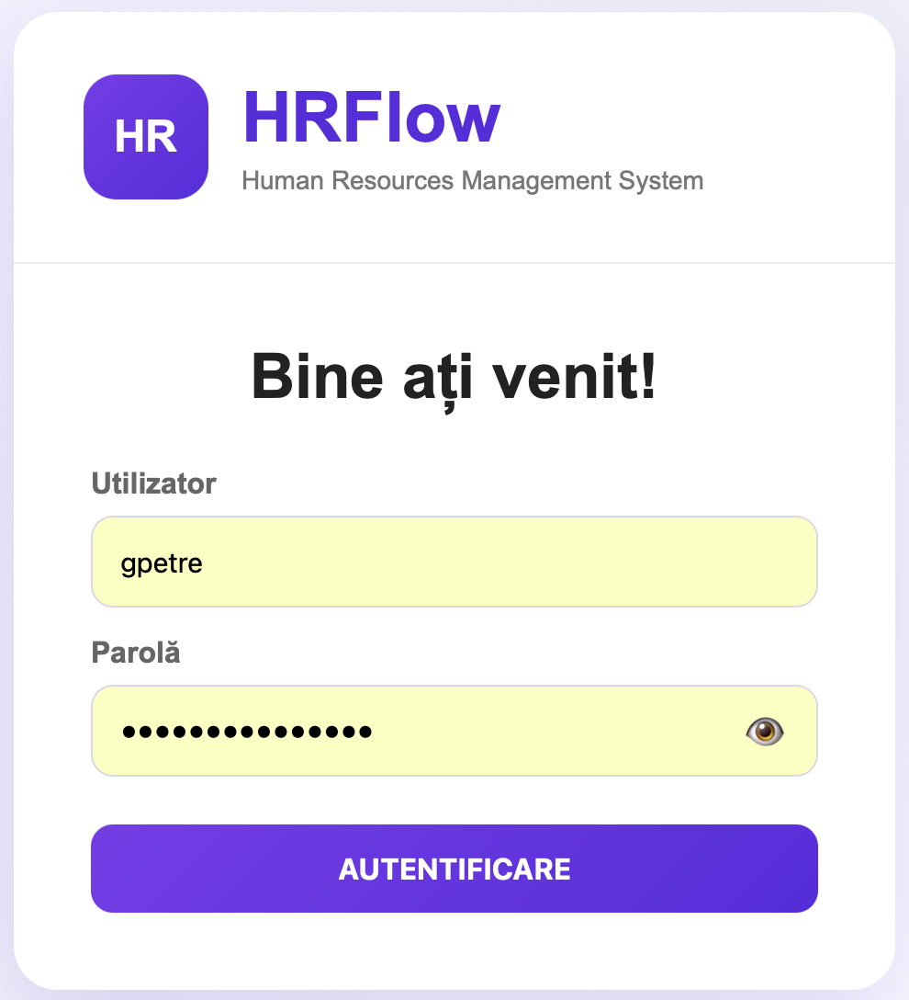
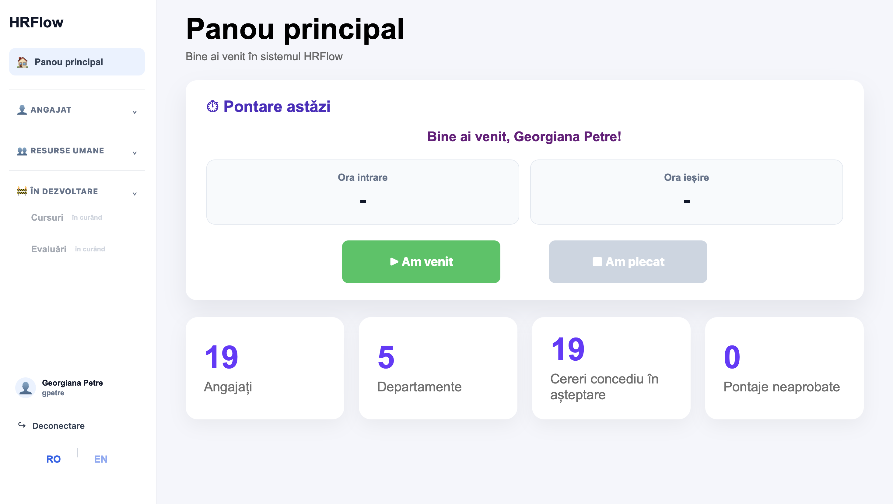
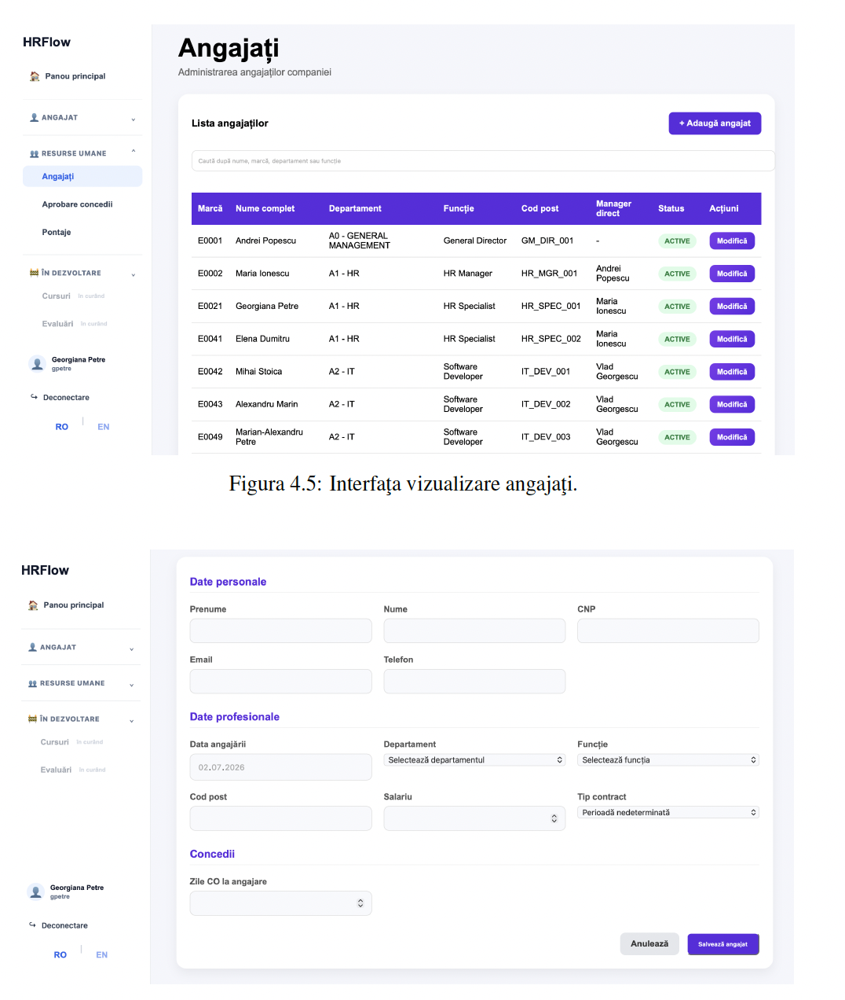
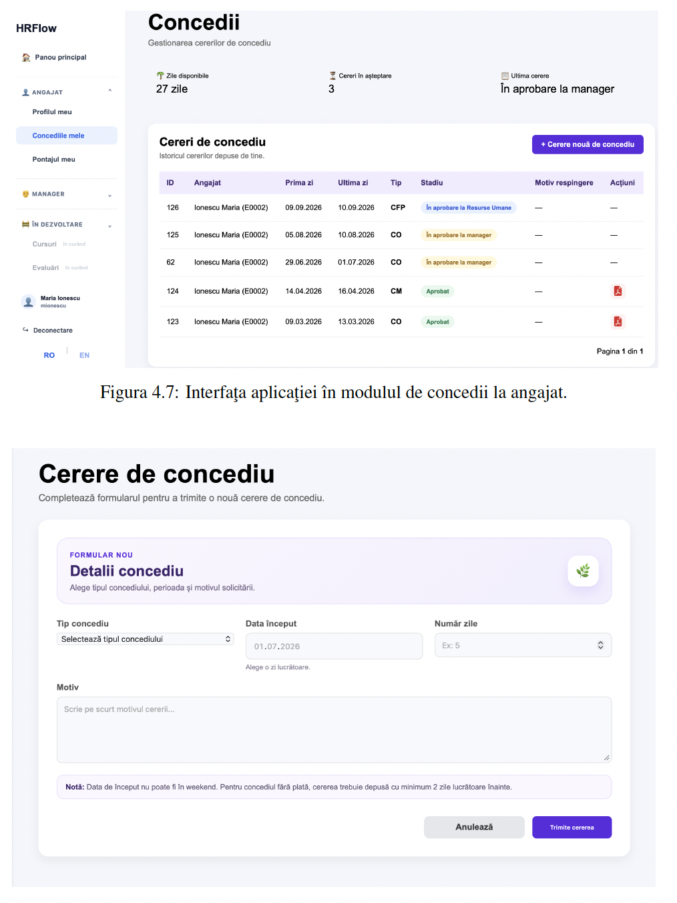
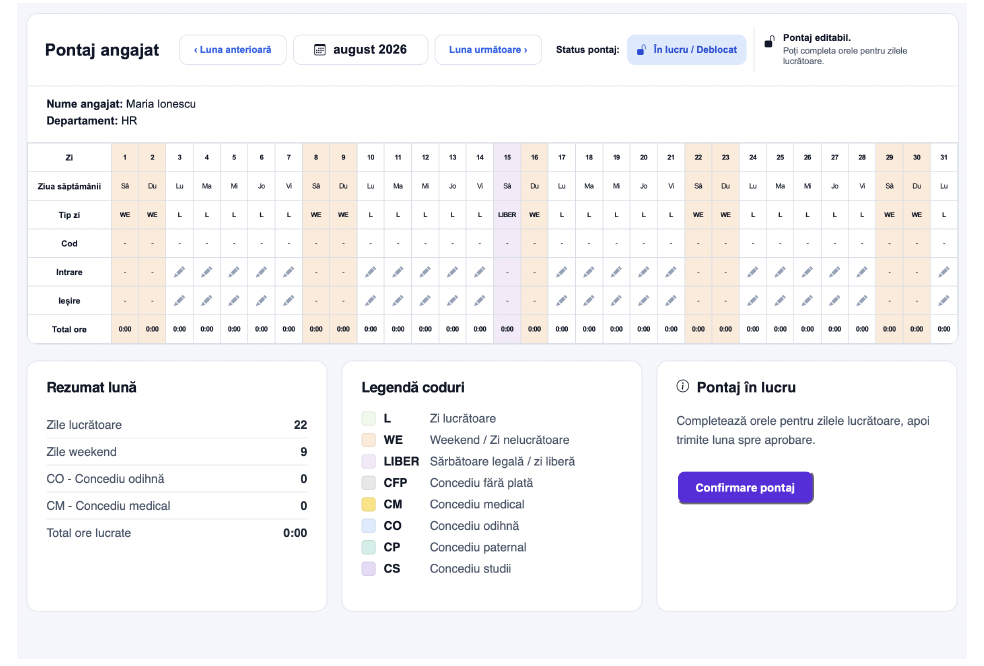
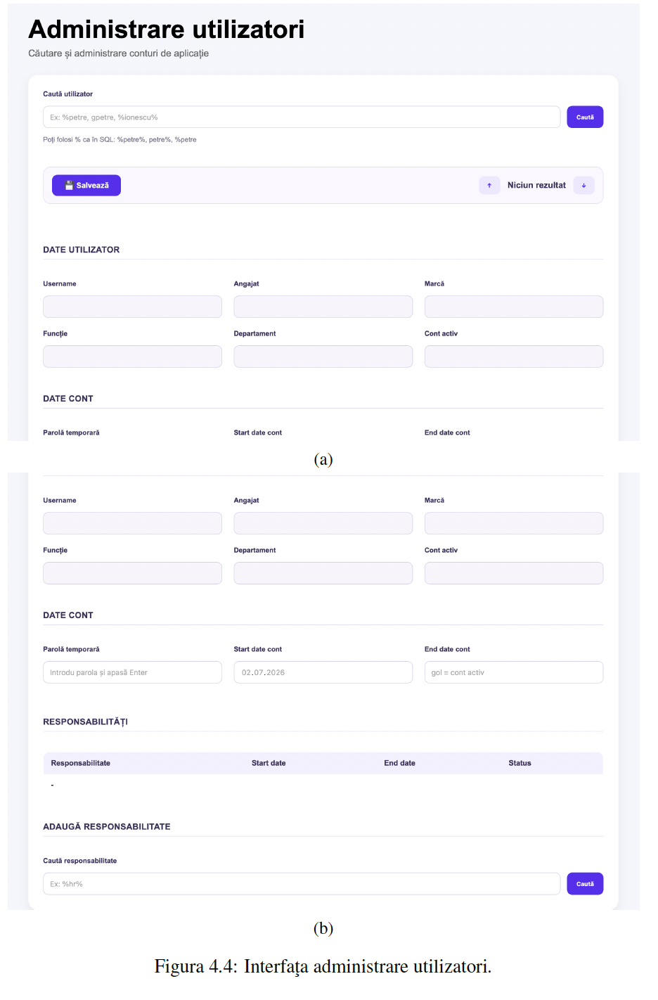

# HRFlow

## Secure Human Resources Management System

HRFlow is a secure Human Resources Management System developed as part of my Master's thesis at **Ovidius University of Constanța**.

The application was built using **Java**, **Spring Boot** and **Oracle Database** following enterprise software development principles. It provides secure authentication, role-based authorization and dedicated workflows for employees, managers, HR personnel and administrators.

---

# Technologies

## Backend

- Java
- Spring Boot
- Spring Security
- Spring Data JPA
- Hibernate
- Maven

## Database

- Oracle Database
- SQL
- PL/SQL

## Frontend

- Thymeleaf
- HTML5
- CSS3
- JavaScript

## Reporting

- OpenPDF
- Apache POI

---

# Main Features

## Authentication & Security

- Secure user authentication
- Role-based authorization
- BCrypt password encryption
- Spring Security integration
- Account activation and deactivation

---

## Employee Management

- Employee administration
- Department management
- Position management
- User account management

---

## Leave Management

### Employee

- Submit leave requests
- View leave history
- Track request status

### Manager

- Review leave requests
- Approve or reject requests

### HR

- Validate approved leave requests
- Manage leave records
- Generate leave request documents (PDF)

---

## Attendance Management

### Employee

- Submit monthly attendance

### Manager

- Review attendance records
- Approve or reject attendance submissions

### HR

- Validate attendance records
- Manage attendance history
- Export attendance reports to Excel

---

# User Roles

The application provides dedicated functionality for different user roles:

- Administrator
- HR
- Manager
- Employee

Each role has access only to the functionality assigned through Spring Security authorization.

---

# Application Architecture

The application follows a layered architecture based on the MVC design pattern.

---

# Database Schema

The application uses an Oracle relational database designed specifically for HR management.

---

# Screenshots

## Login

---

## Dashboard

---

## Employee Management

---

## Leave Management

---

## Attendance Management

---

## Users Management

---

# Video Demonstration

A full demonstration of the application is available here:

🎥 **https://drive.google.com/file/d/1PxTxK-TNTcKGq_Pd7LVBb1ulRfrQWFte/view?usp=sharing**

---

## Master's Thesis

📄 docs/HRFlow_Master_Thesis.pdf

# Future Improvements

- Email notifications
- REST API integration
- Docker containerization
- Kubernetes deployment
- JWT authentication
- Cloud deployment (Azure / Oracle Cloud)

# Project Information

**Master's Thesis**

**Design and Implementation of a Secure Human Resources Application Using Advanced Oracle Database Security Features**

**Grade:** 10/10

Ovidius University of Constanța

---

# Author

**Georgiana Petre**

Database Administrator | Oracle Database Developer | Java Backend Developer
